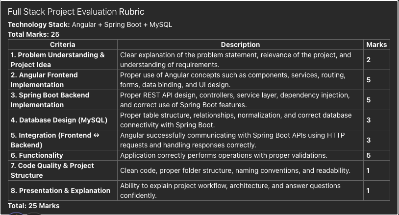

# Mthree-Final

Final Capstone Project for Sakib and Jeter

### To launch `./startup.sh`

## Rubric

<!--  -->

## Full Stack Project Evaluation Rubric

**Technology Stack:** Angular + Spring Boot + MySQL
**Total Marks:** 25

---

### 1. Problem Understanding & Project Idea — 2 marks

- [ ] Clear explanation of the problem statement
- [ ] Relevance of the project
- [ ] Understanding of requirements

---

### 2. Angular Frontend Implementation — 5 marks

- [ ] Components
- [ ] Services
- [ ] Routing
- [ ] Forms
- [ ] Data binding
- [ ] UI design

---

### 3. Spring Boot Backend Implementation — 5 marks

- [ ] Proper REST API design
- [ ] Controllers
- [ ] Service layer
- [ ] Dependency injection
- [ ] Correct use of Spring Boot features

---

### 4. Database Design (MySQL) — 3 marks

- [ ] Proper table structure
- [ ] Relationships
- [ ] Normalization
- [ ] Correct database connectivity with Spring Boot

---

### 5. Integration (Frontend ↔ Backend) — 3 marks

- [ ] Angular communicating with Spring Boot APIs using HTTP requests
- [ ] Handling responses correctly

---

### 6. Functionality — 5 marks

- [ ] Application correctly performs all operations
- [ ] Proper validations

---

### 7. Code Quality & Project Structure — 1 mark

- [ ] Clean code
- [ ] Proper folder structure
- [ ] Naming conventions
- [ ] Readability

---

### 8. Presentation & Explanation — 1 mark

- [ ] Ability to explain project workflow and architecture
- [ ] Able to answer questions confidently

---

**Total: 25 marks**

## Springboot Generation

## Rest Api Documentation

- Similar to the autogernated documentation used with swagger fast api
- Accessed through the url `http://localhost:8080/docs`

# Database

- financeDB
  - Schemas
    - Users
      - id : BIGINT , auto generated, primary key, not null
      - email : VARCHAR(255), non-repeatable, not null
      - password : VARCHAR(255), not null
      - created_at : DATE, not null
      - last_login : DATE
    - Transactions
      - id : BIGINT, primary key, not null auto generated
      - stock_symbol : VARCHAR(10), not null
      - price : DECIMAL(10,2), not null
      - quantity : DECIMAL(10,2), not null
      - total_amount : DECIMAL(10,2), not null
      - type : ENUM(BUY, SELL), not null
      - user_id : BIGINT, foreign key references users(id), not null
      - created_at : DATETIME, not null persistent
    - Accounts
      - id : BIGINT, auto generated, primary key, not null
      - user_id : BIGINT, foreign key references users(id), not null
      - first_name : VARCHAR(255), not null
      - last_name : VARCHAR(255), not null
      - cash_balance : DECIMAL(10,2), not null, default 10000.00
    - Stock Cache
      - symbol       : VARCHAR(10), primary key, not null
      - current_price : DECIMAL(10,2)
      - open_price    : DECIMAL(10,2)
      - high_price    : DECIMAL(10,2)
      - low_price     : DECIMAL(10,2)
      - updated_at    : DATETIME

    - Stock History Cache
      - id            : BIGINT, auto generated, primary key, not null
      - symbol        : VARCHAR(10), not null
      - time_interval : VARCHAR(20), not null
      - history_json  : LONGTEXT, not null
      - cached_at     : DATETIME, not null
      - expires_at    : DATETIME, not null
